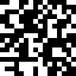

# π-day-2021

This year is 16x16 tiles using the digits of π. 



Download the imagery from here:

https://blackchip.org/pi-day-2021

## Building the Imagery

Download a billion hexadecimal digits of π from:

https://archive.org/details/pi_hex_1b

The zip file contains a zip file that has the same name which is a bit strange. Unzip in a different directory. In the repository 
root, create a `pi` directory and place the `pi_hex_1b.txt` file there. 

Install [go](https://golang.org/dl/) and run with:

```bash
go run pi.go 
```

Each hexadecimal digit is converted into four pixels. Each row contains four digits and each image contains a total of 64 digits. For easier viewing, the image is zoomed in by 8 so that each "pixel" is actually an 8x8 square. 

Each volume contains 10,000 images and 100 volumes are created. These are found in the `images` directory. Create zip files in the `dist` directory using `make-dist.sh`. 

And why do this? To see if there is a Pac-Man image hidden in π somewhere. A Pooka would be nice too. 

## License

MIT

